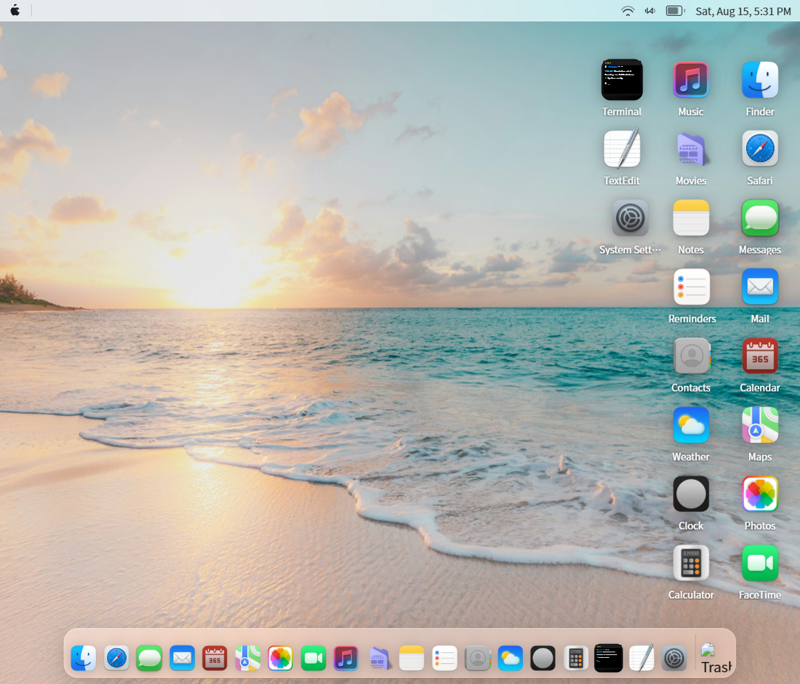
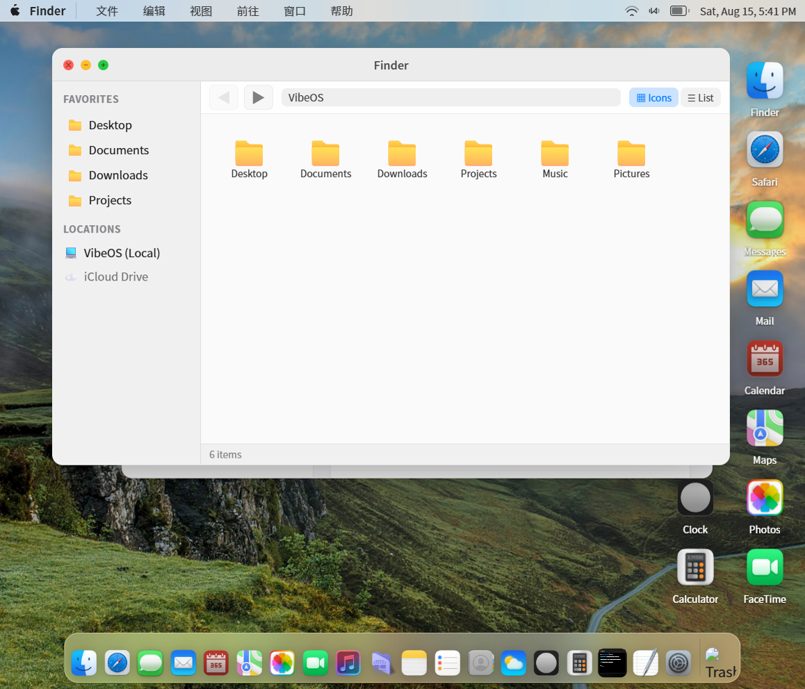
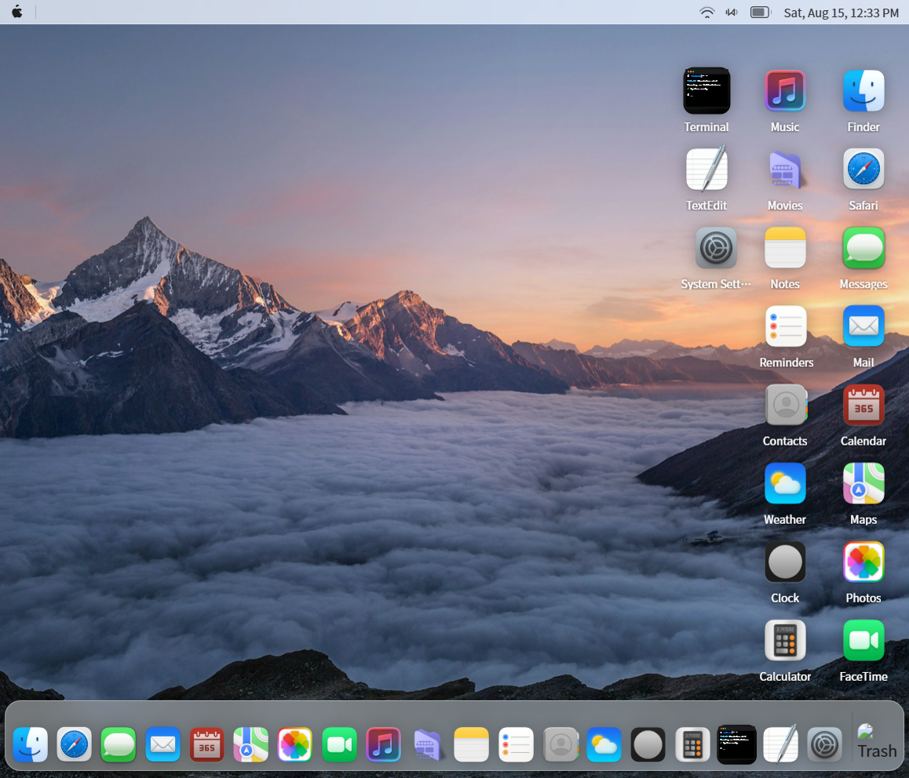
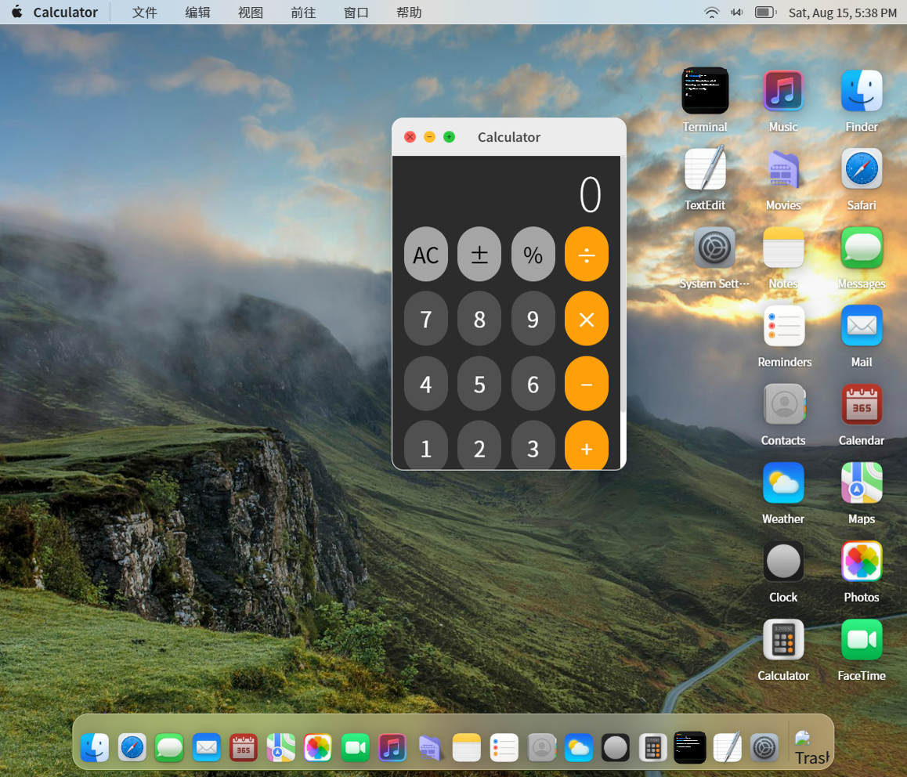

# mac-sim-os

> 在浏览器中运行的 macOS 风格操作系统模拟器


---

## 在线预览

<div align="center">
  
</div>

👉 **[点击体验完整交互式预览](https://wly790515.github.io/mac-sim-os/preview.html)** · [返回仓库主页](https://github.com/WLY790515/mac-sim-os)

---

## 截图

| 桌面主界面 | Finder 文件管理 |
|---|---|
|  |  |

| Terminal 终端 | 计算器 |
|---|---|
|  |  |

---

## ✨ 已实现功能

### 桌面系统
- **macOS 风格窗口管理**：拖拽移动、边缘缩放、z-index 层级管理
- **红绿灯按钮动画**：关闭（红）→ 居中缩小淡出；最小化（黄）→ easeIn 吸入 Dock；最大化（绿）→ easeOut 平滑展开
- **启动屏**：Apple Logo + 进度条，加载完成后自动切换桌面
- **顶部菜单栏**：实时时钟、WiFi / 音量 / 电池状态图标
- **桌面**：壁纸渐变、桌面图标双击打开应用

### Dock 栏
- **悬停弹跳动画**：CSS `transform: scale()` + cubic-bezier 弹性曲线
- **图标位置共享**：通过 ref 系统同步 Dock 图标与窗口动画坐标

### 内置应用（19 个）

| 应用 | 功能 |
|------|------|
| **Terminal** | 多标签终端，支持 ls/cd/cat/mkdir/touch/rm/cp/mv/echo/head/tail/find/grep/tree/neofetch 等命令，Tab 自动补全，命令历史，工作目录独立追踪 |
| **Finder** | IndexedDB 虚拟文件系统浏览，支持图标/列表视图切换、侧边栏导航、面包屑路径、右键菜单、文件上传/下载、重命名、搜索 |
| **Safari** | 浏览器模拟，地址栏导航、历史记录前进/后退、书签面板 |
| **Clock** | 模拟时钟（60fps 平滑指针）、世界时钟、秒表、闹钟 |
| **Calculator** | 标准计算器 |
| **Notes** | 简易备忘录 |
| **Music** | 音乐播放器 |
| **Calendar** | 日历视图 |
| **Contacts** | 联系人管理 |
| **Messages** | 消息应用 |
| **Mail** | 邮件应用 |
| **Photos** | 照片浏览器 |
| **Maps** | 地图应用 |
| **Weather** | 天气应用 |
| **Videos** | 视频播放器 |
| **FaceTime** | 视频通话应用 |
| **Reminders** | 提醒事项 |
| **Editor** | 文本编辑器（行号、Tab 缩进） |
| **Settings** | 系统设置（主题切换、壁纸选择） |

### 特效系统
- **Spotlight 全局搜索**：Cmd+Space 呼出，搜索所有应用
- **Notification Center**：通知中心面板
- **Control Center**：控制中心（WiFi/蓝牙/亮度/音量快捷开关）

### 键盘快捷键
- **Cmd+W** — 关闭当前窗口
- **Cmd+M** — 最小化窗口
- **Cmd+Q** — 退出所有指定应用的窗口
- **Cmd+D** — 聚焦桌面
- **Cmd+F** — 全屏切换
- **Cmd+←/→/↑/↓** — 边缘分屏（左/右/上/下）

### 部署支持
- **GitHub Pages** 自动部署（CI/CD 流水线）
- **Railway** 一键部署（Caddy 静态服务）
- **Electron 桌面客户端**：本地打包为 .exe/.dmg 可执行文件

---

## 🗺️ 规划路线图

### Phase 1 — 核心体验优化 ✅ 已完成
- [x] macOS 风格窗口动画（easeOut/easeIn cubic 曲线）
- [x] 窗口阴影层级优化（激活/非激活双层阴影）
- [x] 多窗口管理改进（拖拽贴边分屏 + Cmd+方向键快速分屏）
- [x] 键盘快捷键增强（Cmd+W 关闭、Cmd+M 最小化、Cmd+Q 退出所有窗口）

### Phase 2 — 文件系统增强 ✅ 已完成
- [x] IndexedDB 持久化虚拟文件系统（真实文件上传/下载）
- [x] Finder 完整右键菜单（打开/下载/重命名/删除/新建文件夹/新建文件）
- [x] 文件夹嵌套导航 + 面包屑路径
- [x] 40+ 种文件类型图标区分（文档/图片/音频/视频/代码/压缩等）
- [x] 搜索栏过滤文件名

### Phase 3 — 终端系统 ✅ 已完成
- [x] 多标签页终端 UI（新建/关闭/切换标签）
- [x] 完整文件系统命令集（ls/cd/cat/mkdir/rm/cp/mv/touch/echo）
- [x] 高级命令（head/tail/find/grep/tree/neofetch）
- [x] Tab 自动补全文件名/目录名
- [x] 命令历史（↑↓方向键）
- [x] 每个标签页独立工作目录
- [x] Ctrl+C 中断、Ctrl+L 清屏

### Phase 4 — 更多原生应用
- [ ] 系统偏好设置完整化（显示器、声音、网络、蓝牙）
- [ ] App Store 界面（模拟应用商店）
- [ ] 日历完整日程管理
- [ ] 备忘录富文本编辑

### Phase 5 — 性能与体验
- [ ] WebGL 壁纸动画
- [ ] 窗口缩略图预览（Mission Control）
- [ ] Spotlight AI 搜索建议
- [ ] 离线 PWA 支持

### Phase 6 — 社区与扩展
- [ ] 插件系统（第三方应用开发）
- [ ] 共享配置导出/导入
- [ ] 更多主题皮肤
- [ ] 移动端适配

---

## 🛠️ 技术栈

| 层 | 技术 |
|----|------|
| 前端框架 | React 18 + TypeScript 5 + Vite 5 |
| 状态管理 | React `useReducer` + Context API（自定义） |
| 文件系统 | IndexedDB（自定义 Wrapper，`filesystem.ts`） |
| 终端命令引擎 | 自研虚拟文件系统命令层（`terminal.ts`），完全对接 IndexedDB |
| 桌面客户端 | Electron（可选） |
| 静态服务 | Caddy（Railway 部署） |
| CI/CD | GitHub Actions（自动部署到 GitHub Pages） |
| 包管理 | npm |

---

## 📁 目录结构

```
vibeos/
├── client/                              # React 前端应用（Vite + Electron）
│   ├── src/
│   │   ├── apps/                       # 各应用组件（19 个内置应用）
│   │   │   ├── Calculator.tsx
│   │   │   ├── Finder.tsx
│   │   │   ├── Terminal.tsx
│   │   │   └── ...
│   │   ├── components/                 # 桌面核心组件
│   │   │   ├── Window.tsx              # 单窗口组件（含动画引擎）
│   │   │   ├── WindowManager.tsx       # 窗口管理器
│   │   │   ├── Dock.tsx                # Dock 栏
│   │   │   ├── MenuBar.tsx             # 顶部菜单栏
│   │   │   ├── Spotlight.tsx           # Spotlight 搜索
│   │   │   ├── BootScreen.tsx          # 启动屏
│   │   │   ├── TerminalTab.tsx         # 单标签终端组件
│   │   │   └── iconRefs.ts             # Dock 图标位置共享
│   │   ├── contexts/                   # AppRegistry 上下文
│   │   ├── lib/                        # 核心库
│   │   │   ├── filesystem.ts           # IndexedDB 文件系统封装
│   │   │   └── terminal.ts             # 终端命令执行引擎
│   │   ├── stores/                     # 应用状态（useReducer + Context）
│   │   │   └── app.store.tsx
│   │   ├── types/                      # TypeScript 类型定义
│   │   ├── registry.tsx                # 应用注册表（Dock 顺序）
│   │   ├── App.tsx                     # 根组件
│   │   └── main.tsx                    # 入口
│   ├── public/icons/                   # 应用图标资源（PNG / 动态 SVG）
│   ├── electron/                       # Electron 源文件
│   ├── electron-main.ts                # Electron 主进程入口
│   └── package.json
├── server/                             # Railway 部署服务端
│   └── Caddyfile                       # Caddy 静态文件服务
├── assets/                             # README 截图资源
├── .github/
│   └── workflows/
│       └── deploy.yml                  # GitHub Pages 自动部署
├── Dockerfile                          # Railway Docker 构建
└── README.md                           # 本文档
```

---

## 🚀 快速开始

### 环境要求
- Node.js ≥ 18

### 安装依赖

```bash
cd client
npm install
```

### 启动开发服务器

```bash
npm run dev
```

访问 http://localhost:5173

### 本地生产预览

```bash
npm run build
npm run preview
```

### 打包 Electron 桌面应用

```bash
npm run electron:build
```

生成 Windows `.exe` 安装包。

---

## 🌐 部署

### GitHub Pages（推荐，免费）

项目已内置 GitHub Actions 自动部署，推送到 master 分支后自动构建。

1. 打开 [Settings → Pages](https://github.com/WLY790515/mac-sim-os/settings/pages)
2. **Source** 选择 **GitHub Actions**
3. 等待 Actions 完成部署

访问：https://wly790515.github.io/mac-sim-os/

### Railway（备选）

1. 打开 [railway.app](https://railway.app)，GitHub 登录
2. **New Project** → **Deploy from GitHub repo** → 选择 `WLY790515/mac-sim-os`
3. Railway 自动检测 Dockerfile 和 Caddyfile 并构建
4. 点击 **View Live** 获取地址

### 自定义域名（Railway）

1. 进入项目 **Settings** → **Domains**
2. 点击 **Add Domain**，输入你的域名
3. 按提示配置 DNS（CNAME 指向 Railway 分配的地址）

---

## 🎨 图标资源

图标存放在 `client/public/icons/` 目录：

- **21 个 PNG 应用图标**（从 macosicons.com 批量下载）
- **3 个动态 SVG 图标**：
  - `clock_dynamic.svg` — 时针/分针/秒针实时旋转
  - `calendar_dynamic.svg` — 显示当前日期和星期
  - `terminal_dynamic.svg` — 带闪烁光标动画

---

## 📄 License

MIT

---

> 如有问题或建议，欢迎提交 Issue 或 Pull Request ⭐
